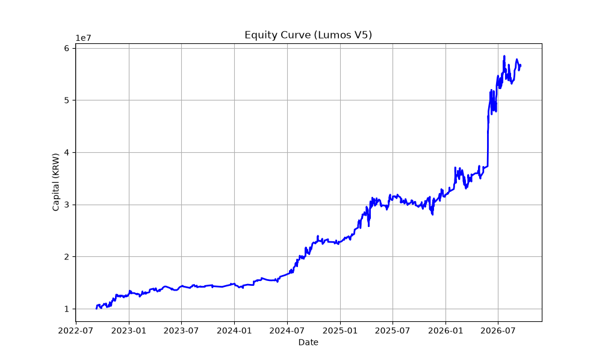

# Lumos V5 Backtest Report

## 1. Test Information
* **Date**: 2026-09-18 08:00:50
* **Period**: 2022-09-12 ~ 2026-09-17
* **Duration**: 4.01 years

## 2. Core Parameters (config.py)
* GBDT Confidence Threshold: `0.6`
* Time Stop: `120 min`
* Trailing Stop: Trigger `1.50%`, Drop `0.30%`
* Max TP: `10.00%`
* Commission & Slippage: `0.002`
* Feature Stacking & Cross-Asset Veto: `Enabled` (V5 standard)

## 3. Performance Metrics
* **Initial Capital**: 10,000,000 KRW
* **Final Capital**: 56,563,614 KRW
* **Total Return**: +465.64%
* **CAGR**: +53.99%
* **Max Drawdown (MDD)**: -12.62%
* **Win Rate**: 62.48%
* **Total Trades**: 805

## 4. Equity Curve

